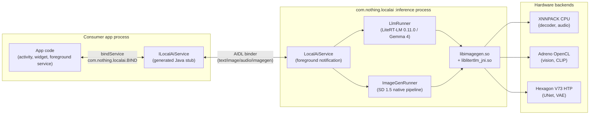
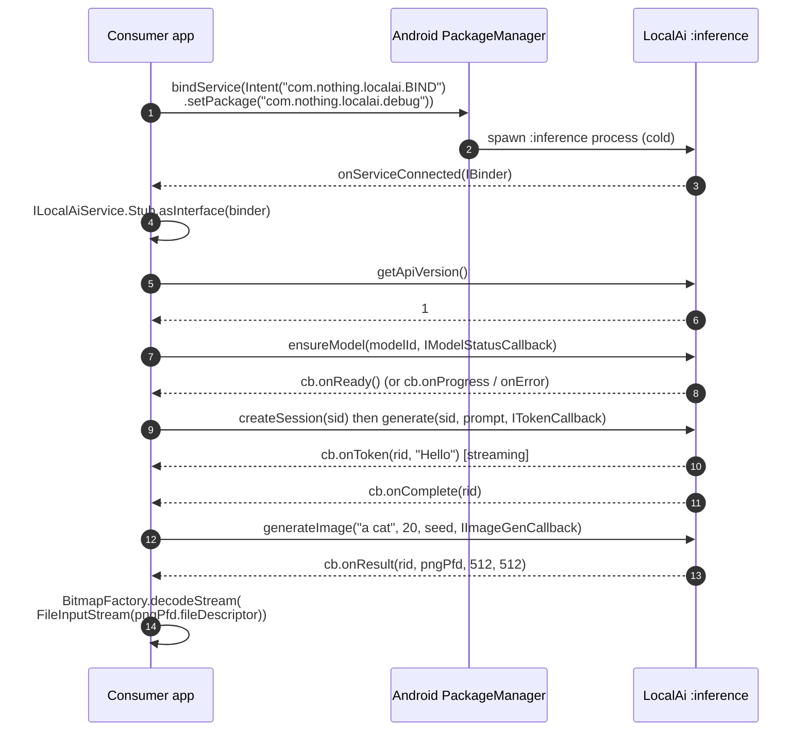
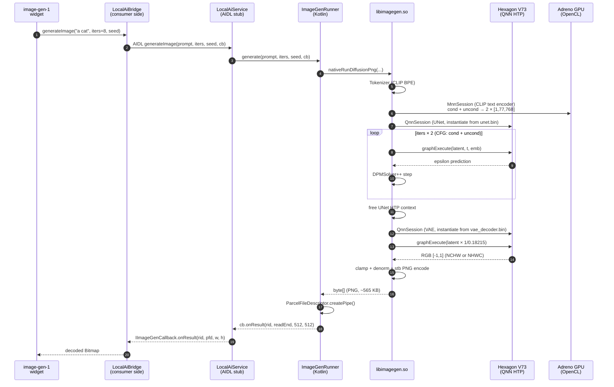

# LocalAi

Sibling APK that hosts on-device models and exposes them to Aiwidget over AIDL.

## Status

Validated end-to-end on Snapdragon 8s Gen 4 (SM8735) and merged to `main`. All
three Gemma 4 E4B modalities working: text + image (GPU/OpenCL) + audio
(CPU/XNNPACK, PCM16 wrapped in WAV). The 0.10.2 vision SIGSEGV that drove the
previous revert is gone in 0.11.0.

**On-device Stable Diffusion 1.5** also live, running on the Hexagon V73 NPU
via Qualcomm QAIRT/QNN. 8-step "a cat" generates a recognizable 512×512 image
end-to-end (text encode + UNet diffusion + VAE decode + PNG); widget round-trip
(`image-gen-1` → AIDL → `ImageGenRunner` → `libimagegen.so` → PFD pipe) works.
See the [Image generation](#image-generation-stable-diffusion-15-on-hexagon-npu)
section.

## Process model

LocalAi is a standalone APK that hosts every model in a separate
`:inference` process and exposes a single bound `Service` over AIDL. Consumer
apps bind to it, never load the models themselves, and never see the
underlying runtime (LiteRT-LM, QNN, MNN). The contract is the AIDL surface;
everything else is implementation detail.



Default model: **Gemma 4 E4B IT (`.litertlm`, ~3.66 GiB)** — multimodal text +
image + audio. Gemma 3n E2B/E4B `.task` specs are still in the catalog but the
runner only loads `.litertlm` now; selecting a `.task` model id will fail at
load time. Gemma 4 E2B is also in the catalog (~2.59 GB) and selectable via
`ModelId.DEFAULT = GEMMA4_E2B_INT4`.

Standalone vision (`classifyImage`) and audio (`transcribe`, `speak`) AIDL
methods are stubbed — multimodal input goes through `addImage` / `addAudio`
on a chat session.

## Toolchain

- AGP 8.9.1 / Kotlin 2.3.0 / Gradle 8.12
- minSdk 31, target 36
- arm64-v8a only
- LiteRT-LM `com.google.ai.edge.litertlm:litertlm-android:0.11.0`

Kotlin 2.3.0 is required for this branch: `litertlm-android:0.11.0` ships
Kotlin metadata 2.3.0 and won't read on 2.1.x. Aiwidget can stay on 2.1.10 —
AIDL is generated Java, so the cross-APK contract is unaffected by the
Kotlin version drift.

## Model setup (Gemma 4 E4B IT, `.litertlm`)

Until a download URL is wired into `ModelCatalog`, push manually:

```bash
# 1. Sign in to HuggingFace, accept the Gemma license, then download the
#    generic .litertlm (NOT the -web.task; that's a browser/WebGPU bundle and
#    won't load in LiteRT-LM-Android):
#    https://huggingface.co/litert-community/gemma-4-E4B-it-litert-lm
#    File: gemma-4-E4B-it.litertlm  (~3.66 GB)

# 2. Push via the helper script:
~/Documents/GitHub/localai/scripts/push-model.sh ~/Downloads/gemma-4-E4B-it.litertlm

# Or manually:
adb push gemma-4-E4B-it.litertlm /data/local/tmp/
adb shell "run-as com.nothing.localai.debug mkdir -p files/models"
adb shell "run-as com.nothing.localai.debug cp /data/local/tmp/gemma-4-E4B-it.litertlm files/models/"
```

For the smaller **E2B** variant (~2.59 GB, faster cold load, lower quality), push
`gemma-4-E2B-it.litertlm` from `litert-community/gemma-4-E2B-it-litert-lm` and
flip `ModelId.DEFAULT` to `GEMMA4_E2B_INT4`. (The E2B repo also ships
`qualcomm_sm8750` and `qualcomm_qcs8275` NPU-specialized bundles; neither
matches our SM8735 / Snapdragon 8s Gen 4, so we stay on the generic bundle.)

## Modalities

- **Text** — `addQueryChunk` (handled internally by `generate(prompt)`).
  Decoder runs on XNNPACK CPU.
- **Image** — `addImage(jpegFd)`. JPEG PFD staged to `cacheDir/session-<sid>/img-*.jpg`,
  fed as `Content.ImageFile(path)`. Max 4 images per turn. Vision encoder runs
  on OpenCL via the `LITERT_CL` delegate (Adreno).
- **Audio** — `addAudio(pcmFd, sampleRate)`. PCM16 mono PFD read into memory,
  wrapped in a 44-byte WAV header (because `Content.AudioBytes` runs through
  miniaudio, which won't decode raw PCM), and fed as `Content.AudioBytes(byte[])`.
  Gemma 4's USM encoder expects 16 kHz; a different rate is logged but not
  rejected. Audio encoder + adapter run on XNNPACK CPU — the bundle's audio
  weights are CPU-only and `Engine.initialize()` rejects GPU.

## Session model (single-active)

LiteRT-LM 0.11.0 enforces **one `Conversation` per `Engine`** — the release
notes' "multi-session support" is CLI-only; the Android binding throws
`FAILED_PRECONDITION: A session already exists` on the second
`createConversation`. `SessionRegistry` enforces this by closing every other
live `ChatSession` before constructing a new one. Multi-widget UX still works,
just serialized: whichever widget is most recently touched holds the live
conversation; stale widgets rebuild KV cache on their next turn.

## Smoke test

```bash
# 1. Install debug APK
./gradlew :app:installDebug

# 2. Tail logcat in another shell, scoped to the tags that matter
adb logcat -c && adb logcat \
  LlmRunner:V LocalAiService:V SessionRegistry:V \
  tflite:V AndroidRuntime:E libc:F DEBUG:F "*:S" \
  | grep -v "XNNPack weight cache: written"

# 3. From the Aiwidget side, exercise text / image / audio via the
#    chatbot-1, camera-vision-1, audio-prompt-1 widgets.
```

What you should see on a healthy cold load (one-time; subsequent loads hit
the on-disk XNNPack weight caches):

```
tflite:  Initialized TensorFlow Lite runtime.
tflite:  XNNPack weight cache loaded from ...gemma-4-E4B-it.litertlm.xnnpack_cache_*
tflite:  Replacing 2199 out of 2712 nodes with delegate (TfLiteXNNPackDelegate)   # text decoder
tflite:  Replacing 8 out of 8 nodes ...                                           # MTP heads (x16)
tflite:  Loaded OpenCL library with dlopen.
tflite:  Replacing 1477 out of 1477 nodes with delegate (LITERT_CL)               # vision encoder (x3 subgraphs)
tflite:  XNNPack weight cache loaded ...vision_adapter.xnnpack_cache_*
tflite:  XNNPack weight cache loaded ...static_audio_encoder.xnnpack_cache_*
tflite:  XNNPack weight cache loaded ...audio_adapter.xnnpack_cache_*
```

If you instead see `Fatal signal 11 (SIGSEGV)` referencing
`liblitertlm_jni.so`, the vision path regressed — file an issue against
[google-ai-edge/LiteRT-LM](https://github.com/google-ai-edge/LiteRT-LM/issues)
with the chip (SM8735), LiteRT-LM version, model bundle, and crashing offset.

## Signing

For `signature`-level binding to work, this APK and Aiwidget must be signed
with the same key. Debug builds share the Android debug key automatically.
For dev convenience, `BIND_AI` is currently `protectionLevel="normal"`.

## Using LocalAi from another app

LocalAi exposes a single bound `Service`. Any app on the device can use it
by (1) installing the LocalAi APK once, (2) copying the AIDL contract, and
(3) binding with the right permission + intent action.

### 1. Install the APK

```bash
# Build + install the debug APK directly from this repo
./gradlew :app:installDebug

# Or push a prebuilt APK to a fresh device
adb install -r app-debug.apk

# Confirm the service is registered
adb shell pm list packages | grep nothing.localai
adb shell dumpsys package com.nothing.localai.debug | grep -A 1 "Service Resolver"
```

Then push at least one model bundle so the service has something to serve.
See [Model setup (Gemma 4 E4B IT)](#model-setup-gemma-4-e4b-it-litertlm) for
the LLM and [Setting up the bundle](#setting-up-the-bundle) for SD 1.5.

### 2. Mirror the AIDL contract

Every consumer copies these four files **byte-identical** into its own
`src/main/aidl/com/nothing/localai/`:

```
ILocalAiService.aidl
ITokenCallback.aidl
IModelStatusCallback.aidl
IImageGenCallback.aidl
```

Keeping them byte-identical (same package, same parameter order) is what
makes the binder marshalling agree across processes — see the comments in
each file. Methods may only be **appended** at the end of
`ILocalAiService.aidl`; reordering or removing breaks binary compatibility
with already-installed consumers.

### 3. Declare permission + visibility, bind, call



**Consumer `AndroidManifest.xml`:**

```xml
<!-- Required even with protectionLevel="normal" — silently ignored on grant
     but blocks the bind without it. -->
<uses-permission android:name="com.nothing.localai.permission.BIND_AI" />

<!-- Android 11+: package visibility. Without this, the consumer cannot
     resolve com.nothing.localai when calling bindService. -->
<queries>
    <package android:name="com.nothing.localai" />
    <package android:name="com.nothing.localai.debug" />
</queries>
```

**Consumer Kotlin (bind + call):**

```kotlin
private var service: ILocalAiService? = null

private val conn = object : ServiceConnection {
    override fun onServiceConnected(name: ComponentName, binder: IBinder) {
        service = ILocalAiService.Stub.asInterface(binder)
        // Always sanity-check the API version before calling new methods.
        // Bump the constant in ILocalAiService.aidl when new methods land.
        val v = service?.apiVersion ?: 0
        if (v < 1) { /* unsupported — unbind */ }
    }
    override fun onServiceDisconnected(name: ComponentName) { service = null }
}

fun bind(ctx: Context) {
    val intent = Intent("com.nothing.localai.BIND").apply {
        // Debug builds use the .debug suffix; release uses no suffix.
        setPackage("com.nothing.localai.debug")
    }
    ctx.bindService(intent, conn, Context.BIND_AUTO_CREATE)
}

fun streamText(prompt: String) {
    val sid = "s-${UUID.randomUUID()}"
    service?.createSession(sid)
    service?.generate(sid, prompt, object : ITokenCallback.Stub() {
        override fun onToken(rid: String, token: String) { /* append to UI */ }
        override fun onComplete(rid: String) { /* finalize */ }
        override fun onError(rid: String, code: String, msg: String) { /* … */ }
    })
}

fun generateImage(prompt: String, iters: Int = 20) {
    service?.generateImage(prompt, iters, /*seed=*/ 42L,
        object : IImageGenCallback.Stub() {
            override fun onStep(rid: String, step: Int, totalSteps: Int) {}
            override fun onResult(rid: String, pngFd: ParcelFileDescriptor,
                                  width: Int, height: Int) {
                val bmp = BitmapFactory.decodeStream(
                    ParcelFileDescriptor.AutoCloseInputStream(pngFd))
                // post to UI thread, recycle pngFd is auto-handled
            }
            override fun onError(rid: String, code: String, msg: String) {}
        })
}
```

### 4. Threading and lifecycle gotchas

- **The service runs in `:inference`, a separate process.** All AIDL calls
  cross a binder boundary; arguments are marshalled. Don't pass live
  `Bitmap` / `InputStream` — wrap binary data in a `ParcelFileDescriptor`.
- **Callbacks fire on a binder thread**, not the caller's thread. Marshal
  to the UI thread (`Handler` / `Dispatchers.Main`) before touching views.
- **`createSession` is single-active per process.** LiteRT-LM 0.11.0
  enforces one live `Conversation` per `Engine`; LocalAi closes prior
  sessions automatically. Multiple consumer apps share that one slot — the
  most recent caller "wins" and earlier callers rebuild KV cache on their
  next turn.
- **Cancel cleanup is the caller's job.** Hold the returned `requestId` and
  call `cancel(requestId)` / `cancelImageGen(requestId)` when the user
  navigates away; otherwise the service will keep streaming tokens and
  burning the NPU until completion.
- **Multimodal input.** Use `addImage(sid, jpegFd)` / `addAudio(sid, pcmFd,
  rate)` *before* the next `generate(sid, …)` call on the same session.
  Max 4 images per turn. Audio is 16 kHz mono PCM16; other rates are
  logged but not rejected.
- **Image generation never reuses a session.** It's stateless from the
  caller's perspective — each `generateImage` is a fresh diffusion run.

### 5. Production signing

For shipping to end users, change `BIND_AI` from `protectionLevel="normal"`
to `"signature"` in LocalAi's manifest. Then every consumer app must be
signed with the **same release key** as LocalAi, or the bind silently
fails. Debug builds share the Android debug key automatically and don't
need this.

## Hardware notes

LiteRT-LM 0.11.0 runs the text decoder on XNNPACK CPU, the vision encoder
on Adreno via OpenCL (`LITERT_CL` delegate), and the audio encoder on
XNNPACK CPU. No chip-specialized `.litertlm` exists for SM8735 (Snapdragon
8s Gen 4) on the HuggingFace `litert-community` repos — only
`qualcomm_sm8750` (8 Elite) and `qualcomm_qcs8275` (Dragonwing IoT). Even on
this runtime we don't get Hexagon NPU acceleration; the win versus MediaPipe
`tasks-genai` is Gemma 4 quality + full multimodal coverage, not raw
throughput.

If/when Google ships a `sm8735` bundle, swap the filename in `ModelCatalog`
and the runner will pick up NPU automatically — no other changes needed.

## Image generation (Stable Diffusion 1.5 on Hexagon NPU)

Independent of the Gemma 4 multimodal LLM, LocalAi includes an on-device SD 1.5
diffusion pipeline running on the Hexagon NPU via Qualcomm QAIRT/QNN. End-to-end:
text prompt → tokens → CLIP text encoder (MNN, Adreno GPU via OpenCL) → UNet
diffusion loop with classifier-free guidance (QNN HTP, V73) → VAE decoder
(QNN HTP) → PNG. No external services, no LiteRT involvement; only the AIDL
surface and foreground notification policy are shared with the LLM path.

This is "Plan B": clean-room native C++ consuming xororz HF pre-converted SD
QNN bundles. See `IMAGE-GEN-PLAN.md` for the phase plan and `KNOWN-ISSUES.md`
for why MediaPipe Image Generator (Plan A) and LiteRT/AI Hub (Plan A2) were
abandoned.

### Architecture



UNet and VAE `QnnSession`s are sequential, not concurrent — the UNet session
is destroyed after the diffusion loop completes so the VAE has a clean HTP
context to load into. Memory headroom: UNet binary ~840 MB, VAE ~57 MB,
CLIP ~250 MB. With Gemma 4 E4B also resident (~3.7 GB) the device fits
comfortably with 12 GB RAM headroom.

### Native pipeline (`app/src/main/cpp/`)

| File | Role |
|------|------|
| `imagegen.cpp` | JNI surface — `nativePing`, `nativeSetAdspLibraryPath`, `nativeInspectQnnBinary`, `nativeRunMnnTextEncode`, `nativeRunDiffusion`, `nativeRunDiffusionPng` |
| `qnn_session.{hpp,cpp}` | RAII wrapper around a single QNN HTP context: `dlopen` `libQnnHtp.so` / `libQnnSystem.so`, version-tolerant metadata extraction, unsigned PD opt-in, graph execute |
| `mnn_session.{hpp,cpp}` | Alibaba MNN runtime for the `clip_v2.mnn` text encoder (OpenCL preferred, CPU fallback) |
| `tokenizer.{hpp,cpp}` | CLIP BPE tokenizer reading the HF `tokenizer.json` spec |
| `bundle_loader.{hpp,cpp}` | xororz HF bundle manifest validation |
| `scheduler.{hpp,cpp}` | Pure-C++ DPM-Solver++ (2nd-order multistep, midpoint solver). Defaults to SD 1.5 betas (β_start=0.00085, β_end=0.012, scaled-linear). |
| `diffusion.{hpp,cpp}` | Orchestrates: tokenize → CLIP forward ×2 (cond + uncond) → UNet loop (iters × 2 for CFG) → VAE decode → uint8 RGB → PNG. Detects NCHW vs NHWC at the VAE boundary from graph metadata. |
| `png_encode.cpp` | stb_image_write isolation TU (single PNG writer compile unit) |
| `3rdparty/MNN` | Submodule, built static into `libimagegen.so` (OpenCL + ARM82, no KleidiAI) |
| `3rdparty/nlohmann/` | Header-only JSON for the tokenizer |
| `3rdparty/stb/` | Public-domain `stb_image_write.h` v1.16 |

### SM8735 gotchas (resolved)

These caused multi-hour debugging sessions; documenting so future-you
doesn't repeat them.

1. **Unsigned PD** — FastRPC defaults to *signed* process domain on SM8735,
   which a debug-signed (untrusted) app cannot offload to. The kernel logs
   `Untrusted application trying to offload to signed PD`. Resolved by
   explicit `QNN_HTP_DEVICE_CONFIG_OPTION_SIGNEDPD` /
   `useSignedProcessDomain=false` in `qnn_session.cpp::instantiate`.
2. **`<uses-native-library>`** — `libQnnHtp.so` opens `libcdsprpc.so` /
   `libadsprpc.so` / `libsdsprpc.so` (vendor FastRPC libs). On minSdk 31+
   the app linker namespace doesn't include them by default; the manifest
   must declare them via `<uses-native-library required="false">`. Without
   this, `dlopen` succeeds but the FastRPC handshake fails opaquely.
3. **`ADSP_LIBRARY_PATH`** — FastRPC loads the per-Hexagon-revision Skel
   (`libQnnHtpV73Skel.so` for V73) by *filesystem* path, not via `dlopen`.
   Point it at `applicationInfo.nativeLibraryDir` *before* the first
   `QnnContext_createFromBinary` call. `useLegacyPackaging=true` is also
   required so AGP extracts the Skel onto the filesystem rather than
   mmapping it inside the APK.
4. **ufp16 quant on the boundary** — xororz exports UNet I/O as
   `QNN_DATATYPE_UFIXED_POINT_16` with per-tensor scale/offset.
   `packFloats` / `unpackFloats` honor the
   `QnnTensorInfo::quantScale` / `quantOffset` extracted from `binaryInfo`.
   Both directions: `q = round(f/scale) - offset`, `f = (q + offset) * scale`.
5. **VAE latent scale** — SD 1.5 encodes with `latent * 0.18215`. Before
   passing UNet latents to the VAE decoder, multiply by `1.0 / 0.18215`.
6. **Layout detection** — xororz UNet and VAE both export with consistent
   layout, but it can be either NCHW or NHWC across bundles. `diffusion.cpp`
   classifies the VAE output at runtime by checking which axis carries the
   channel count, and transposes to HWC interleaved for stb's PNG writer.

### Setting up the bundle

Validated against the `xororz/sd-qnn` HuggingFace repository (e.g.
`AbsoluteReality_qnn2.28_8gen2.zip`). The xororz bundles target Hexagon V75
(8 Gen 2) but the context binaries also load on V73 (8s Gen 4 / 8 Gen 3) —
the HTP instruction set is forward-compatible for these operators.

```bash
# 1. Download a bundle (HuggingFace account required)
curl -L -o /tmp/bundle.zip \
  https://huggingface.co/xororz/sd-qnn/resolve/main/AbsoluteReality_qnn2.28_8gen2.zip
unzip /tmp/bundle.zip -d /tmp/bundle

# 2. Push to device — the script strips the bundle's
#    output_512/qnn_models_8gen2/ wrapper and atomically swaps it in.
./scripts/push-diffusion-bundle.sh /tmp/bundle/output_512/qnn_models_8gen2
```

The bundle ships `tokenizer.json`, `clip_v2.mnn`, `pos_emb.bin`,
`token_emb.bin`, `unet.bin` (~840 MB), `vae_encoder.bin`, and
`vae_decoder.bin` (~57 MB).

### Smoke test

`LocalAiApp.onCreate` runs a boot probe (background thread) that drives the
full pipeline at 8 inference steps with prompt "a cat" and writes the result
to `filesDir/sd-debug.png`. To inspect:

```bash
adb shell run-as com.nothing.localai.debug cat files/sd-debug.png > /tmp/sd-debug.png
open /tmp/sd-debug.png
```

Expected logcat (cold load with the bundle present):

```
imagegen: text encode done (NNN ms)
diffusion: step 1/8 (t=...) latents[min=... max=...]
...
diffusion: step 8/8 ...
imagegen: vae NCHW 512x512 range[-1.5,1.3] pngBytes=565622 timing: load=380ms exec=720ms total=1260ms
LocalAiApp: diffusion-to-png probe OK: pngBytes=565622 → .../files/sd-debug.png
```

End-to-end wall time (cold): ~30 s for 8 iters at 512×512 on SM8735. Steady-
state per iter is dominated by 2× UNet passes (cond + uncond CFG) at ~415 ms
each. 20+ iters produce noticeably crisper output if you can spend the time.

### Widget path

The `image-gen-1` testwidget calls `LocalAiBridge.generateImage`, which
marshals through the AIDL surface to `ImageGenRunner.generate`. The PNG
bytes return via a `ParcelFileDescriptor.createPipe()` — the write end is
closed after the byte array drains; the read end crosses the binder
boundary and is decoded back to a bitmap on the widget side.

`onStep` AIDL events are not wired yet — the first stage delivers a single
`onResult` once the PNG is ready. Per-step progress UI requires a
`NativeCallback` JNI bridge from the diffusion loop, which is a follow-up.

### Build dependencies (QAIRT / QNN SDK)

The native library only builds with `IMAGEGEN_HAS_QNN` defined, which
Gradle flips on if `QNN_SDK_ROOT` resolves. Precedence: `QNN_SDK_ROOT` env
var, then `qnn.sdk.root` in `local.properties`. Without it the stub
implementation reports the missing config cleanly but cannot execute.

```properties
# local.properties (do not commit)
qnn.sdk.root=/path/to/qairt/2.46.0.260424
```

The `stageQnnLibs` Gradle task copies `libQnn*.so` from
`${QNN_SDK_ROOT}/lib/aarch64-android/` plus the per-Hexagon-revision Skel
libs from `${QNN_SDK_ROOT}/lib/hexagon-v{68,69,73,75,79,81}/unsigned/` into
`build/qnn-libs/arm64-v8a/`, which is wired as an extra `jniLibs.srcDirs`
in `app/build.gradle`. The Skel libs are NOT committed (proprietary, ~50 MB
each); each developer installs QAIRT locally and points `local.properties`
at it.
